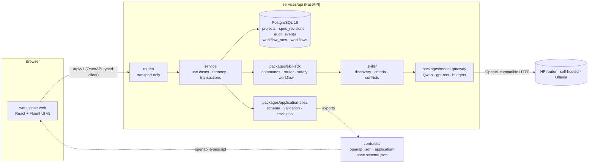

# Architecture overview

## Milestone 1 request flow: saving a specification

1. The web app sends `PUT /api/v1/projects/{id}/spec` with `If-Match: "r3"`.
2. FastAPI validates the body structurally against `ApplicationSpec` (unknown fields,
   types, status/provenance invariants). Failures → 422 with JSON paths.
3. The service locks the project row in the caller's tenant, compares revisions (412 on
   mismatch), runs semantic validation (422 on dangling references), and skips the write if
   nothing changed semantically.
4. Revision metadata is stamped by diffing against r3; a new immutable r4 and an audit event
   are written in one transaction; the response carries `ETag: "r4"`.

## Milestone 2 flow: a multi-step workflow (ADR-0012)

1. `POST /projects/{id}/workflows` creates a `workflows` row whose `state` is the
   checkpoint, and the first step's run (an ordinary `workflow_runs` row), in one transaction.
2. The run executes in the background: screening (ADR-0011), routing to the step's explicit
   skill, a model call through the gateway, and typed proposals. In the same transaction as
   the run's result, the checkpoint moves the step to `awaiting_review`. A step with nothing
   to propose completes, and the next step starts.
3. The person applies decisions (`If-Match`, ADR-0003). One transaction writes the new
   revision, completes the step, and creates the next step's run against that revision.
4. If the process stops mid-step, the stale run is marked `interrupted`. Reading the workflow
   reconciles the step to `failed`, and **Resume** retries it a bounded number of times.

## Planned components (not implemented yet)

| Component | Milestone |
|---|---|
| Design-system registry, Fluent 2 adapter, UI intermediate representation | 3 |
| React generation, isolated build runner, preview | 4 |
| Angular / Material 3 | 6 |
