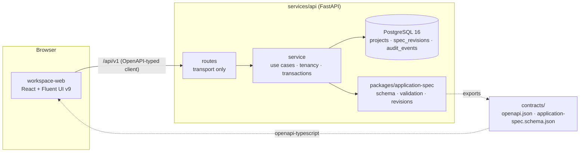

# Architecture overview

## Milestone 1 request flow: saving a specification

1. The web app sends `PUT /api/v1/projects/{id}/spec` with `If-Match: "r3"`.
2. FastAPI validates the body structurally against `ApplicationSpec` (unknown fields,
   types, status/provenance invariants). Failures → 422 with JSON paths.
3. The service locks the project row in the caller's tenant, compares revisions (412 on
   mismatch), runs semantic validation (422 on dangling references), and skips the write if
   nothing changed semantically.
4. Revision metadata is stamped by diffing against r3; a new immutable r4 and an audit event
   are written in one transaction; the response carries `ETag: "r4"`.

## Planned components (not implemented yet)

| Component | Milestone |
|---|---|
| Model provider abstraction (Qwen via HF, gpt-oss via Ollama), skill registry, orchestration | 2 |
| Design-system registry, Fluent 2 adapter, UI intermediate representation | 3 |
| React generation, isolated build runner, preview | 4 |
| Angular / Material 3 | 6 |
